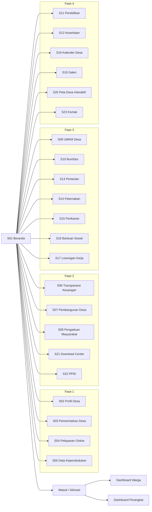

<!-- DIBANGKITKAN OTOMATIS oleh scripts/generate-storyboard.ts — jangan diedit manual. -->
# Storyboard — Website Desa Bintang Ninggi I

Dibangkitkan dari `packages/shared/src/constants/sections.ts` pada 15 Agustus 2026.

- **23 section publik**, 87 layar termasuk turunan dan dashboard
- Alur pengguna langkah demi langkah: lihat [alur-pengguna.md](./alur-pengguna.md)

## 1. Peta Situs

## 2. Inventaris Layar

| ID | Layar | Rute | Akses | Fase |
|---|---|---|---|---|
| S01 | Beranda | `/` | publik | 1 |
| S02 | Profil Desa | `/profil` | publik | 1 |
| S03 | Pemerintahan Desa | `/pemerintahan` | publik | 1 |
| S04 | Pelayanan Online | `/layanan` | publik | 1 |
| S05 | Data Kependudukan | `/kependudukan` | publik | 1 |
| S06 | Transparansi Keuangan | `/keuangan` | publik | 2 |
| S07 | Pembangunan Desa | `/pembangunan` | publik | 2 |
| S08 | Pengaduan Masyarakat | `/pengaduan` | publik | 2 |
| S09 | UMKM Desa | `/umkm` | publik | 3 |
| S10 | BumDes | `/bumdes` | publik | 3 |
| S11 | Pendidikan | `/pendidikan` | publik | 4 |
| S12 | Kesehatan | `/kesehatan` | publik | 4 |
| S13 | Pertanian | `/pertanian` | publik | 3 |
| S14 | Peternakan | `/peternakan` | publik | 3 |
| S15 | Perikanan | `/perikanan` | publik | 3 |
| S16 | Bantuan Sosial | `/bantuan-sosial` | publik | 3 |
| S17 | Lowongan Kerja | `/lowongan` | publik | 3 |
| S18 | Kalender Desa | `/kalender` | publik | 4 |
| S19 | Galeri | `/galeri` | publik | 4 |
| S20 | Peta Desa Interaktif | `/peta` | publik | 4 |
| S21 | Download Center | `/download` | publik | 2 |
| S22 | PPID | `/ppid` | publik | 2 |
| S23 | Kontak | `/kontak` | publik | 4 |
| D-P | Dashboard Perangkat Desa | `/admin` | perangkat | 1 |
| D-W | Dashboard Warga | `/warga` | warga | 1 |

## 3. Rincian Layar per Fase

## Fase 1 — Inti (pelayanan & data)

### S01 · Beranda

| | |
|---|---|
| **Rute** | `/` |
| **Akses** | publik |
| **Fase** | 1 |
| **Tujuan** | Halaman muka: sambutan kepala desa, ringkasan statistik, dan pintu cepat ke semua layanan. |

**Blok pada halaman ini**

- Sambutan Kepala Desa
- Video profil desa
- Statistik desa (penduduk, KK, UMKM, RT/RW, luas wilayah)
- Cuaca — _API BMKG (gratis, tanpa API key)_
- Jam pelayanan
- Nomor darurat
- Tombol cepat menuju semua layanan

**Layar turunan**

| ID | Layar | Rute |
|---|---|---|
| S01-1 | Berita terbaru | `/berita` |
| S01-2 | Pengumuman | `/pengumuman` |
| S01-3 | Agenda kegiatan | `/agenda` |

### S02 · Profil Desa

| | |
|---|---|
| **Rute** | `/profil` |
| **Akses** | publik |
| **Fase** | 1 |
| **Tujuan** | Identitas desa, sejarah, dan seluruh lembaga yang ada di dalamnya. |

**Layar turunan**

| ID | Layar | Rute |
|---|---|---|
| S02-1 | Sejarah desa | `/profil/sejarah` |
| S02-2 | Visi & Misi | `/profil/visi-misi` |
| S02-3 | Struktur organisasi | `/profil/struktur` |
| S02-4 | Profil Kepala Desa | `/profil/kepala-desa` |
| S02-5 | Profil BPD | `/profil/bpd` |
| S02-6 | Profil LPM | `/profil/lpm` |
| S02-7 | Karang Taruna | `/profil/karang-taruna` |
| S02-8 | PKK | `/profil/pkk` |
| S02-9 | BumDes | `/profil/bumdes` |
| S02-10 | RT/RW | `/profil/rt-rw` |
| S02-11 | Perangkat Desa | `/profil/perangkat` |
| S02-12 | Prestasi desa | `/profil/prestasi` |
| S02-13 | Potensi desa | `/profil/potensi` |

> **Catatan:** Sub-item "Lambang dan maknanya" dicoret pada dokumen — tidak dibuat.

### S03 · Pemerintahan Desa

| | |
|---|---|
| **Rute** | `/pemerintahan` |
| **Akses** | publik |
| **Fase** | 1 |
| **Tujuan** | Perangkat desa beserta tugasnya dan seluruh dokumen regulasi & perencanaan. |

**Layar turunan**

| ID | Layar | Rute |
|---|---|---|
| S03-1 | Perangkat desa | `/pemerintahan/perangkat` |
| S03-2 | Tugas masing-masing perangkat | `/pemerintahan/tugas` |
| S03-3 | Peraturan Desa | `/pemerintahan/perdes` |
| S03-4 | Peraturan Kepala Desa | `/pemerintahan/perkades` |
| S03-5 | SK Kepala Desa | `/pemerintahan/sk-kades` |
| S03-6 | RPJMDes | `/pemerintahan/rpjmdes` |
| S03-7 | RKPDes | `/pemerintahan/rkpdes` |
| S03-8 | APBDes | `/pemerintahan/apbdes` |
| S03-9 | Laporan Realisasi APBDes | `/pemerintahan/realisasi-apbdes` |

> **Catatan:** Sub-item "Dokumen PPID" ditandai pada dokumen — dipindahkan ke section PPID (no. 22) agar tidak duplikat.

### S04 · Pelayanan Online

| | |
|---|---|
| **Rute** | `/layanan` |
| **Akses** | publik |
| **Fase** | 1 |
| **Tujuan** | Warga login lalu mengajukan surat; berkas terbit dengan QR Code verifikasi dan tanda tangan elektronik. |

**Blok pada halaman ini**

- Surat Domisili
- Surat Keterangan Usaha
- Surat Tidak Mampu
- Surat Kelahiran
- Surat Kematian
- Surat Pindah
- Surat Pengantar Nikah
- Surat Kehilangan
- Surat Ahli Waris
- Surat Keterangan Belum Menikah
- Surat Keterangan Penghasilan
- Surat Pengantar SKCK
- Surat Izin Keramaian
- Surat lainnya

**Layar turunan**

| ID | Layar | Rute |
|---|---|---|
| S04-1 | Status pengajuan: Diproses / Disetujui / Ditolak / Siap diambil | `/layanan/status` |
| S04-2 | Verifikasi dokumen via QR Code | `/layanan/verifikasi/:kode` |

> **Catatan:** Verifikasi memakai QR mandiri milik desa (hash SHA-256 isi PDF), bukan PSrE tersertifikasi. Surat tetap ditandatangani basah; QR membuktikan lembar yang dipegang benar terbit dari sistem dan isinya belum diubah.

### S05 · Data Kependudukan

| | |
|---|---|
| **Rute** | `/kependudukan` |
| **Akses** | publik |
| **Fase** | 1 |
| **Tujuan** | Dashboard statistik agregat penduduk — angka saja, tanpa data pribadi. |

**Blok pada halaman ini**

- Jumlah Penduduk
- Jumlah KK
- Laki-laki
- Perempuan
- Usia
- Pendidikan
- Agama
- Pekerjaan
- Penyandang Disabilitas
- Balita
- Lansia
- Pendatang
- Kelahiran
- Kematian
- Mutasi

> **Catatan:** Wajib agregat. Data individu hanya di Dashboard Perangkat dengan audit log (UU PDP 27/2022).

## Fase 2 — Transparansi

### S06 · Transparansi Keuangan

| | |
|---|---|
| **Rute** | `/keuangan` |
| **Akses** | publik |
| **Fase** | 2 |
| **Tujuan** | Rincian dan grafik penggunaan anggaran desa per tahun. |

**Blok pada halaman ini**

- APBDes
- Pendapatan
- Belanja
- Realisasi Anggaran
- Dana Desa
- Dana Bagi Hasil
- Grafik penggunaan anggaran
- Proyek yang sedang berjalan

### S07 · Pembangunan Desa

| | |
|---|---|
| **Rute** | `/pembangunan` |
| **Akses** | publik |
| **Fase** | 2 |
| **Tujuan** | Daftar proyek desa lengkap dengan progres, foto, dan titik lokasi di peta. |

**Blok pada halaman ini**

- Daftar proyek
- Lokasi proyek
- Nilai proyek
- Sumber dana
- Foto progres
- Persentase pekerjaan
- Timeline
- Kontraktor
- Pengawas
- Peta lokasi — _Leaflet + OpenStreetMap_
- Proyek selesai
- Dokumen laporan

### S08 · Pengaduan Masyarakat

| | |
|---|---|
| **Rute** | `/pengaduan` |
| **Akses** | publik |
| **Fase** | 2 |
| **Tujuan** | Warga melaporkan masalah dengan foto dan titik GPS, lalu memantau statusnya. |

**Blok pada halaman ini**

- Jalan rusak
- Lampu mati
- Sampah
- Banjir
- Pelayanan
- Konflik sosial
- Kebakaran
- Infrastruktur

**Layar turunan**

| ID | Layar | Rute |
|---|---|---|
| S08-1 | Unggah foto + lokasi GPS | `/pengaduan/buat` |
| S08-2 | Status laporan | `/pengaduan/status` |

### S21 · Download Center

| | |
|---|---|
| **Rute** | `/download` |
| **Akses** | publik |
| **Fase** | 2 |
| **Tujuan** | Arsip berkas yang bisa diunduh warga. |

**Blok pada halaman ini**

- Formulir
- Peraturan Desa
- Surat
- Proposal
- Laporan

### S22 · PPID

| | |
|---|---|
| **Rute** | `/ppid` |
| **Akses** | publik |
| **Fase** | 2 |
| **Tujuan** | Pejabat Pengelola Informasi dan Dokumentasi — klasifikasi informasi publik. |

**Blok pada halaman ini**

- Informasi berkala
- Informasi setiap saat
- Informasi serta merta

**Layar turunan**

| ID | Layar | Rute |
|---|---|---|
| S22-1 | Permohonan informasi | `/ppid/permohonan` |

> **Catatan:** Menampung juga "Dokumen PPID" yang semula tercantum di section Pemerintahan Desa.

## Fase 3 — Ekonomi desa

### S09 · UMKM Desa

| | |
|---|---|
| **Rute** | `/umkm` |
| **Akses** | publik |
| **Fase** | 3 |
| **Tujuan** | Marketplace produk warga dengan keranjang, rating, dan pembayaran QRIS. |

**Blok pada halaman ini**

- Produk makanan
- Kerajinan
- Pertanian
- Peternakan
- Perikanan
- Jasa
- WhatsApp penjual
- Rating
- Pembayaran QRIS (manual) — _Tiap UMKM memasang QRIS sendiri. Pembeli mengunggah bukti bayar, penjual yang memverifikasi — tanpa payment gateway, tanpa desa memegang uang warga._

**Layar turunan**

| ID | Layar | Rute |
|---|---|---|
| S09-1 | Keranjang belanja | `/umkm/keranjang` |
| S09-2 | Pesanan saya | `/umkm/pesanan` |

### S10 · BumDes

| | |
|---|---|
| **Rute** | `/bumdes` |
| **Akses** | publik |
| **Fase** | 3 |
| **Tujuan** | Profil badan usaha milik desa, unit usaha, produk, dan laporannya. |

**Blok pada halaman ini**

- Profil
- Unit usaha
- Laporan
- Produk
- Penyewaan alat
- Investasi desa

### S13 · Pertanian

| | |
|---|---|
| **Rute** | `/pertanian` |
| **Akses** | publik |
| **Fase** | 3 |
| **Tujuan** | Informasi harga komoditas, jadwal tanam, pupuk, dan penyuluhan. |

**Blok pada halaman ini**

- Harga komoditas
- Jadwal tanam
- Cuaca
- Pupuk
- Bantuan
- Penyuluhan
- Alat pertanian
- Irigasi

### S14 · Peternakan

| | |
|---|---|
| **Rute** | `/peternakan` |
| **Akses** | publik |
| **Fase** | 3 |
| **Tujuan** | Program vaksin ternak, informasi penyakit, bantuan bibit, dan penyuluhan. |

**Blok pada halaman ini**

- Vaksin ternak
- Penyakit
- Bantuan
- Bibit
- Jadwal penyuluhan

### S15 · Perikanan

| | |
|---|---|
| **Rute** | `/perikanan` |
| **Akses** | publik |
| **Fase** | 3 |
| **Tujuan** | Bibit ikan, harga jual, bantuan, dan pelatihan budidaya. |

**Blok pada halaman ini**

- Bibit ikan
- Bantuan
- Harga ikan
- Pelatihan

### S16 · Bantuan Sosial

| | |
|---|---|
| **Rute** | `/bantuan-sosial` |
| **Akses** | publik |
| **Fase** | 3 |
| **Tujuan** | Daftar program bantuan; warga mengecek status penerima memakai NIK. |

**Blok pada halaman ini**

- PKH
- BPNT
- BLT
- Bantuan UMKM
- Bantuan Rumah
- KIP
- PIP

**Layar turunan**

| ID | Layar | Rute |
|---|---|---|
| S16-1 | Cek status penerima dengan NIK | `/bantuan-sosial/cek` |

### S17 · Lowongan Kerja

| | |
|---|---|
| **Rute** | `/lowongan` |
| **Akses** | publik |
| **Fase** | 3 |
| **Tujuan** | Papan lowongan lokal, magang, pelatihan kerja, dan rekrutmen perusahaan. |

**Blok pada halaman ini**

- Lowongan lokal
- Magang
- Pelatihan kerja
- Rekrutmen perusahaan

## Fase 4 — Pelengkap

### S11 · Pendidikan

| | |
|---|---|
| **Rute** | `/pendidikan` |
| **Akses** | publik |
| **Fase** | 4 |
| **Tujuan** | Fasilitas pendidikan yang ada di desa beserta program beasiswa. |

**Blok pada halaman ini**

- PAUD
- SD
- Beasiswa
- Perpustakaan Desa
- Jadwal belajar
- Kursus

> **Catatan:** Sub-item "SMP" dan "SMA" dicoret pada dokumen — tidak dibuat.

### S12 · Kesehatan

| | |
|---|---|
| **Rute** | `/kesehatan` |
| **Akses** | publik |
| **Fase** | 4 |
| **Tujuan** | Layanan kesehatan desa: Posyandu, Pustu, ambulans, dan program ibu-anak. |

**Blok pada halaman ini**

- Posyandu
- Jadwal imunisasi
- Pustu — _Koreksi tulisan tangan: "Puskesmas" diganti menjadi "Pustu"._
- Ambulans
- Stunting
- Ibu hamil
- Jadwal dokter

> **Catatan:** Sub-item "Donor darah" dicoret pada dokumen — tidak dibuat.

### S18 · Kalender Desa

| | |
|---|---|
| **Rute** | `/kalender` |
| **Akses** | publik |
| **Fase** | 4 |
| **Tujuan** | Kalender kegiatan desa sepanjang tahun. |

**Blok pada halaman ini**

- Musyawarah Desa
- Posyandu
- Gotong Royong
- Festival
- Hari Besar
- Rapat RT

### S19 · Galeri

| | |
|---|---|
| **Rute** | `/galeri` |
| **Akses** | publik |
| **Fase** | 4 |
| **Tujuan** | Dokumentasi foto, video, dan rekaman drone kegiatan desa. |

**Blok pada halaman ini**

- Foto
- Video
- Drone
- Dokumentasi kegiatan

### S20 · Peta Desa Interaktif

| | |
|---|---|
| **Rute** | `/peta` |
| **Akses** | publik |
| **Fase** | 4 |
| **Tujuan** | Peta desa dengan layer yang bisa dinyalakan per kategori fasilitas. |

**Blok pada halaman ini**

- RT/RW
- Jalan
- Sungai
- Sawah
- Sekolah
- Masjid/Gereja
- Posyandu
- Wisata
- UMKM
- Kantor Desa

> **Catatan:** Leaflet + OpenStreetMap agar tanpa biaya dan tanpa API key.

### S23 · Kontak

| | |
|---|---|
| **Rute** | `/kontak` |
| **Akses** | publik |
| **Fase** | 4 |
| **Tujuan** | Kanal komunikasi resmi desa. |

**Blok pada halaman ini**

- Nomor WA Desa
- Email
- Maps
- Facebook
- Instagram
- TikTok
- YouTube

## 4. Dashboard

### Dashboard Perangkat Desa

| | |
|---|---|
| **Rute** | `/admin` |
| **Akses** | perangkat |
| **Tujuan** | Ruang kerja perangkat desa: kelola data, setujui surat, dan perbarui konten. |

| Menu | Rute |
|---|---|
| Manajemen penduduk | `/admin/penduduk` |
| Manajemen surat | `/admin/surat` |
| Pengaduan | `/admin/pengaduan` |
| Tagihan & pajak | `/admin/tagihan` |
| Keuangan | `/admin/keuangan` |
| Pembangunan | `/admin/pembangunan` |
| Inventaris aset | `/admin/aset` |
| Berita | `/admin/berita` |
| Agenda | `/admin/agenda` |
| Galeri | `/admin/galeri` |
| Dokumen & PPID | `/admin/dokumen` |
| Informasi sektoral | `/admin/informasi` |
| Fasilitas desa | `/admin/fasilitas` |
| Harga komoditas | `/admin/harga` |
| Lowongan kerja | `/admin/lowongan` |
| Bantuan sosial | `/admin/bantuan` |
| Profil desa | `/admin/profil-desa` |
| Absensi perangkat | `/admin/absensi` |
| Statistik real-time | `/admin/statistik` |

### Dashboard Warga

| | |
|---|---|
| **Rute** | `/warga` |
| **Akses** | warga |
| **Tujuan** | Ruang pribadi warga setelah login dengan NIK. |

| Menu | Rute |
|---|---|
| Riwayat surat | `/warga/surat` |
| Pengaduan | `/warga/pengaduan` |
| Status bantuan | `/warga/bantuan` |
| Pajak desa | `/warga/pajak` |
| Tagihan | `/warga/tagihan` |
| Data pribadi | `/warga/profil` |
| Riwayat kegiatan | `/warga/kegiatan` |
| Sertifikat pelatihan | `/warga/sertifikat` |
| UMKM saya | `/warga/umkm` |
| Pesanan saya | `/warga/pesanan` |

## 5. Section yang Dibatalkan

Dua section pada dokumen tulisan tangan dicoret dan **tidak dibuat**:

- **No. 11 Pariwisata Desa** — Dicoret X besar pada dokumen (Destinasi wisata, Penginapan, Kuliner, Kalender event, Tiket online, Galeri, Virtual Tour).
- **No. 22 Aspirasi Warga** — Dicoret X besar pada dokumen (Usulan pembangunan, Voting, Saran).
