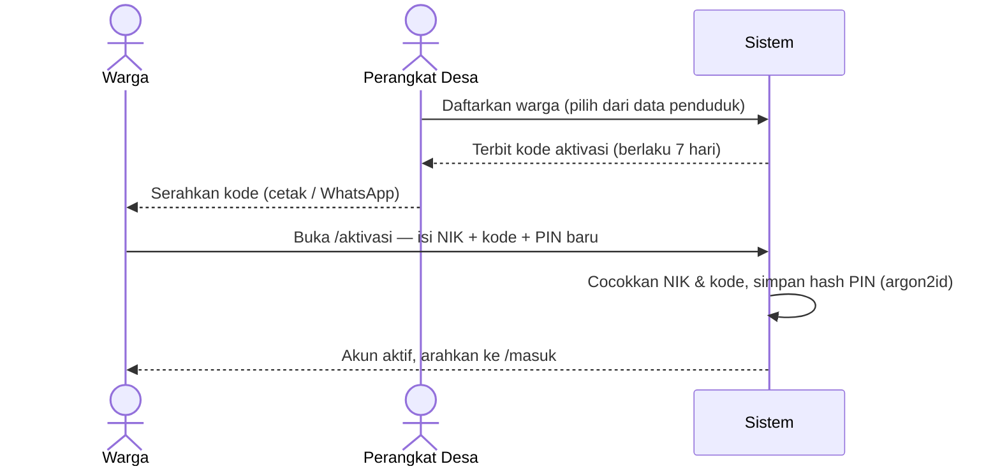
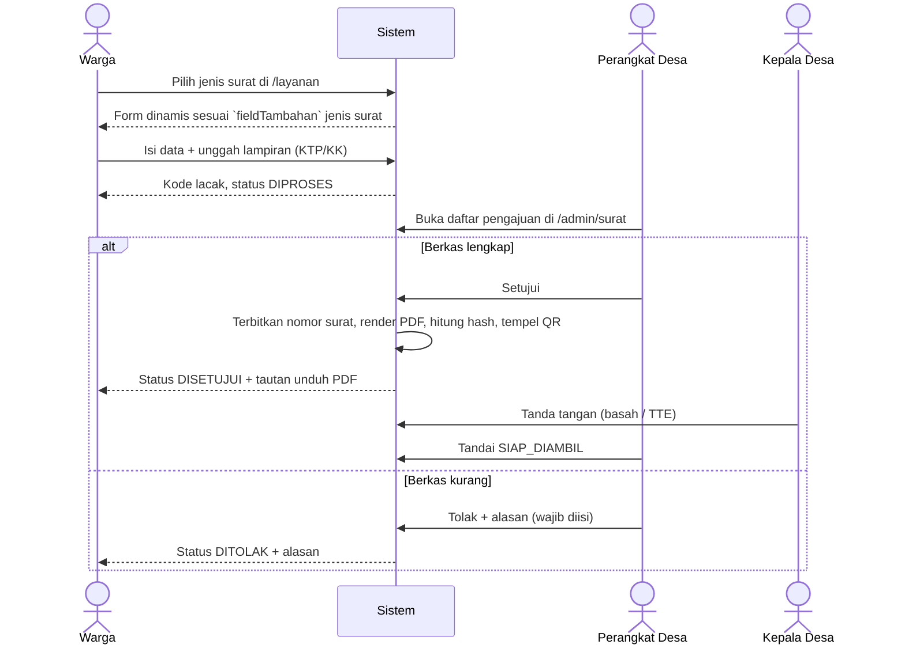
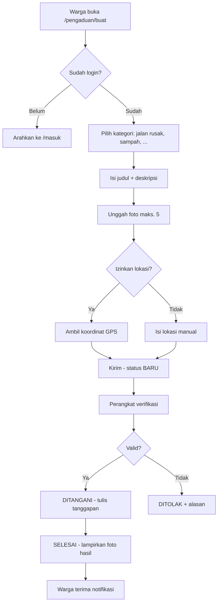
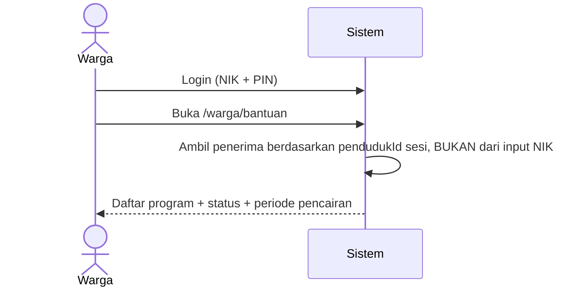
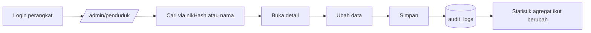

# Alur Pengguna

Bagian storyboard yang tidak bisa dibangkitkan otomatis: urutan langkah yang dilalui
pengguna, siapa yang bertindak, dan di mana keputusan diambil. Lima alur di bawah ini
adalah tulang punggung Fase 1–2.

---

## Alur 1 — Aktivasi akun warga

Alur ini ada karena **NIK bukan rahasia**. Login cukup-NIK berarti siapa pun yang tahu
NIK tetangganya bisa membuka data pribadi orang itu. Karena itu akun harus diaktifkan
lebih dulu lewat perangkat desa.

**Kegagalan yang harus ditangani:** kode kedaluwarsa, kode sudah dipakai, NIK tidak
terdaftar (jangan bocorkan mana yang salah — pesan seragam "NIK atau kode tidak cocok"),
percobaan berulang (kunci 15 menit setelah 5 kali gagal).

---

## Alur 2 — Pengajuan surat sampai terbit

Alur terpenting di seluruh sistem. Perhatikan bahwa surat **tidak langsung jadi PDF**
saat diajukan — PDF baru dibuat setelah disetujui, supaya tidak ada berkas berkop desa
yang beredar tanpa persetujuan.

**Verifikasi keaslian:** QR pada surat mengarah ke `/verifikasi/{kodeLacak}`. Halaman itu
publik dan hanya menampilkan: nomor surat, jenis, tanggal terbit, dan status keaslian —
**tanpa data pribadi pemohon**, karena tautannya bisa dibuka siapa saja yang memegang surat.

---

## Alur 3 — Pengaduan masyarakat

**Keputusan desain:** laporan boleh anonim di tampilan publik (`anonim: true`), tapi
identitas pelapor tetap tersimpan dan terlihat oleh perangkat desa. Tanpa itu, kolom
pengaduan akan dipenuhi laporan palsu.

---

## Alur 4 — Warga mengecek status bantuan sosial

**Penting:** jangan sediakan endpoint publik "cek bantuan dengan NIK". Endpoint semacam
itu bisa dipakai menyisir NIK satu per satu untuk memetakan siapa saja warga miskin di
desa. Status hanya dibuka untuk pemilik akun.

---

## Alur 5 — Perangkat desa memperbarui data penduduk

Setiap pembukaan dan perubahan data penduduk **wajib** tercatat di `audit_logs`
(siapa, kapan, dari IP mana, entitas apa). Ini kewajiban UU PDP No. 27/2022, dan
sekaligus pelindung perangkat desa bila suatu saat ada tuduhan penyalahgunaan data.

---

## Aturan lintas alur

| Aturan | Alasan |
|---|---|
| NIK & nomor KK dienkripsi at rest (AES-256-GCM), dicari lewat kolom HMAC | Bocornya dump database tidak langsung berarti bocornya identitas warga |
| Statistik publik selalu agregat | Halaman Data Kependudukan tidak boleh bisa dipakai menelusuri individu |
| Access token 15 menit + refresh token | Sesi panjang di perangkat bersama (warnet, HP pinjaman) berisiko |
| Rate limit ketat di `/api/auth` | Mencegah percobaan NIK/PIN massal |
| Alasan penolakan wajib diisi | Warga berhak tahu apa yang harus diperbaiki |
